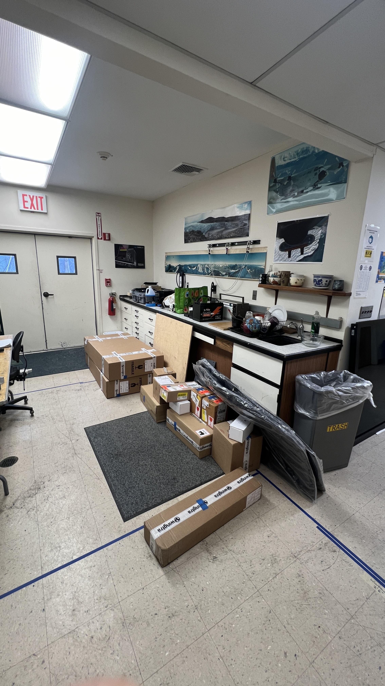
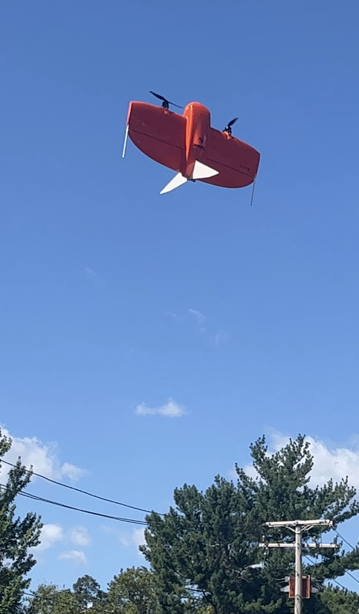

# NSFGEO-NERC: Investigating the Direct Influence of Meltwater on Antarctic Ice Sheet Dynamics

A temporary site for hosting information about the Antarctic Peninslula project. Initially this will be for use across the team and for storing useful information (pictures, news etc.). Later we could turn this into a more public facing site. The github reposoitory behind the site can be found [here](https://github.com/ldeo-glaciology/AntPen_NSF_NERC/blob/main/index.md). 

## About the project
This project is jointly funded by the UK Natural Environment Research Council (NERC) and the US National Science Foundation (NSF). NSF hosts a page about the project [here](https://www.nsf.gov/awardsearch/showAward?AWD_ID=2053169). It is inspired by a paper published by the UK members of the team, ([Tuckett et al., 2019](https://doi.org/10.1038/s41467-019-12039-2)).

The current project team (in alphabetical order):
- Isabel Cordero, Lamont-Doherty Earth Observatory (LDEO), Columbia University, USA
- Jeremy Ely , University of Sheffield, UK
- Nick Frearson, (LDEO), Columbia University, USA
- Stephen Livingstone, University of Sheffield, UK
- Jonathan Kingslake, LDEO, Columbia University, USA
- Andrew Sole, University of Sheffield, UK
- Kate Winter, Northumbria University, UK

The are currently advertising for a postdoctoral researchers to work on the project, one at LDEO and another at Sheffield. The adverts can be found [here](https://apply.interfolio.com/131480) and [here](https://shorturl.at/lmuD3). The closing date for the Sheffield position is  Monday 5th February.

The project will fund two field seasons on Flask Glacier on the Antarctic Peninsula, and continent wide remote sensing. 

The field plan includes:
- Global Navigation Satellite System (GNSS) measurements of ice flow
- Automatic weather station (AWS) measurements of surface melt
- Uncrewed aerial system (UAS) measurements of ice flow
- Ice-penetrating radar measurements of ice flow
- Passive seismic detection of subglacial water flow

The preliminary field plan is shown below.

## News 

### Jan 23rd 2024
The UAS has arrived! Yesterday we received the WingtraOne uncrewed aerial system. More photos to follow.

### Dec 15, 2023
We advertised a Sheffiled-based postdoctoral research associate to work on the project. Details about the job and how to apply can be found [here](https://shorturl.at/lmuD3). Apologies for the incorrect closing date and typos at this link; the closing date is Monday 5th February and we anticipate interviewing for the post later in February.

### Sep 21, 2023
We had Tom from Wingtra at LDEO today demonstrating their UAS. 

### Sep 19, 2023 
Excited to hear that we will be getting a demo from a company called Wingtra of their vertical take off, fixed-wing uncrewed aerial system (UAS) tomorrow on the Lamont campus. 

### Sep 06, 2023 
We advertised for an LDEO-based postdoctoral researcher to work on the project. The advert can be found [here](https://apply.interfolio.com/131480). 

### Aug 2023
The US side of the project kicks off! 

